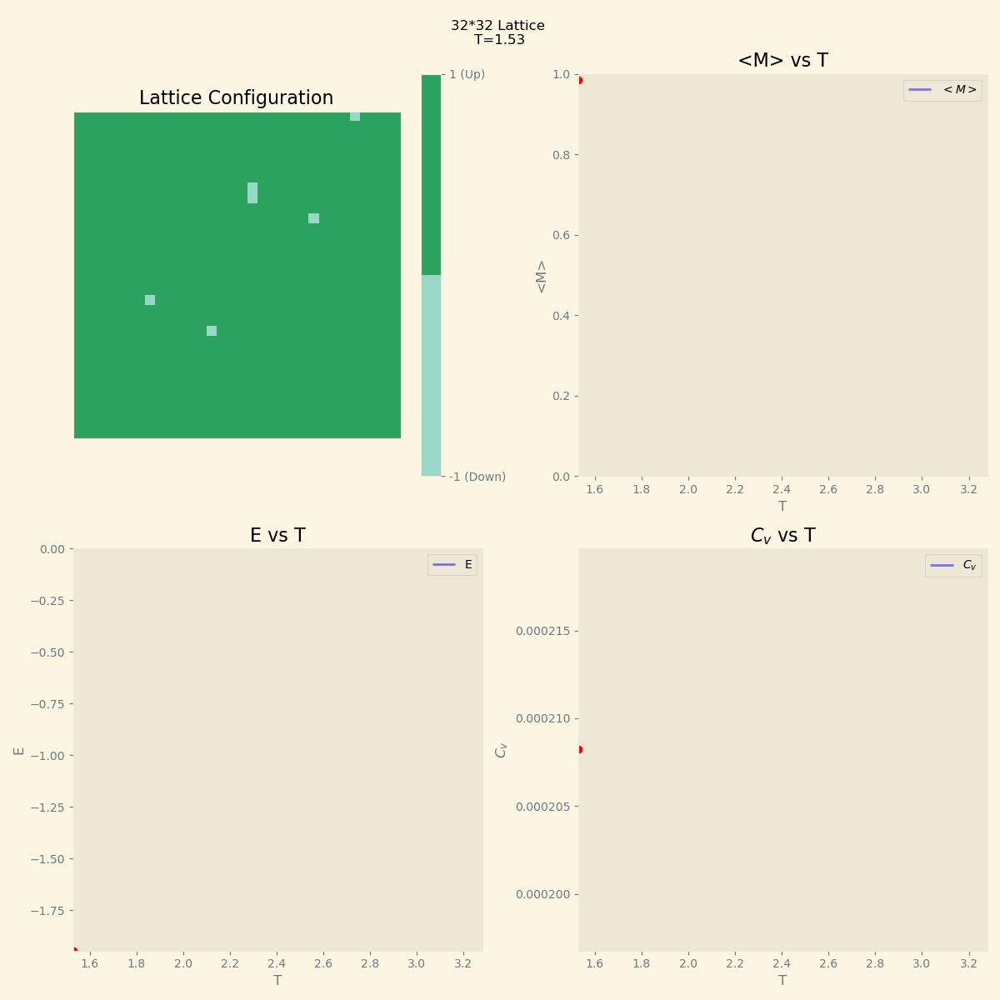

# Ising you sing, everyone sings. 

This code contains ising model simulation on a square lattice using metropolis-hasting algorithm to sample equilibrium states for different temperatures.

This code produces the following gif.

